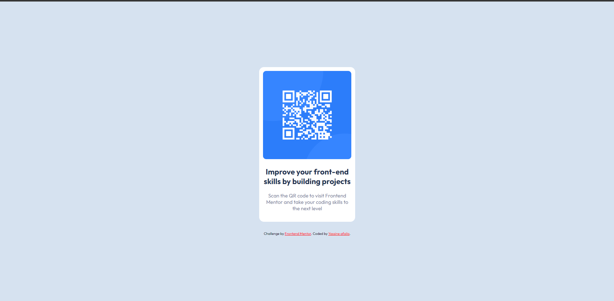

# Frontend Mentor - QR code component solution

This is a solution to the [QR code component challenge on Frontend Mentor](https://www.frontendmentor.io/challenges/qr-code-component-iux_sIO_H). Frontend Mentor challenges help you improve your coding skills by building realistic projects. 

## Overview

### Links

- Solution URL: [Add solution URL here](https://your-solution-url.com)
- Live Site URL: [Add live site URL here](https://your-live-site-url.com)

## My process
## ScreenShot

### Built with

- Semantic HTML5 markup
- CSS custom properties
- Flexbox
- CSS Grid
- Mobile-first workflow

### Useful resources

- [The CSS Reset](https://www.joshwcomeau.com/css/custom-css-reset/) - This helped me for setting the Css reason. I really liked this pattern and will use it going forward.

## Author

- Frontend Mentor - [@Yassineafaila](https://www.frontendmentor.io/profile/Yassineafaila)
- Twitter - [@AfailaYassine](https://www.twitter.com/AfailaYassine)

